# CpmfUipsPack — Architecture Diagrams

---

## 1. Module component overview

Who calls what. Public functions are the contract; private helpers are internal wiring.

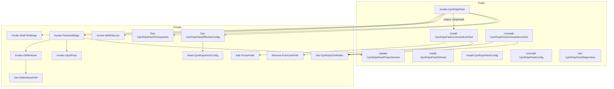

---

## 2. `Invoke-CpmfUipsPack` execution flow

The full orchestration from invocation to staged `.nupkg`.

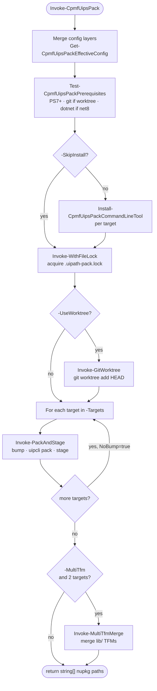

---

## 3. Config hierarchy — four-layer merge

Every setting resolves through four layers. Higher layers never need to remove lower ones.

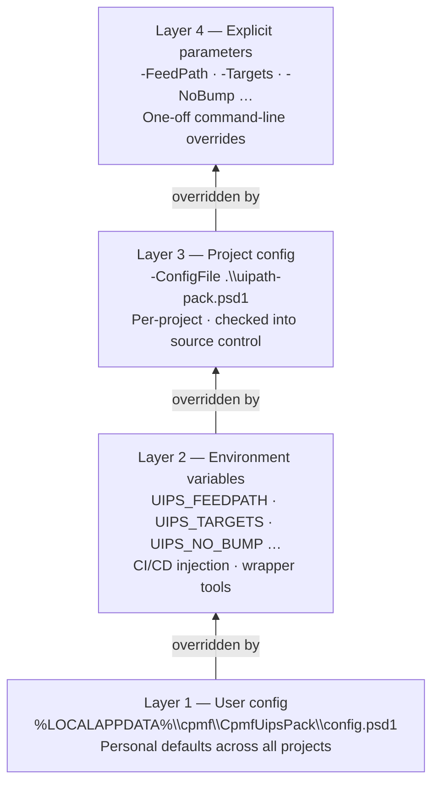

---

## 4. uipcli version family decision tree

Two families, two completely different install paths and exe locations.

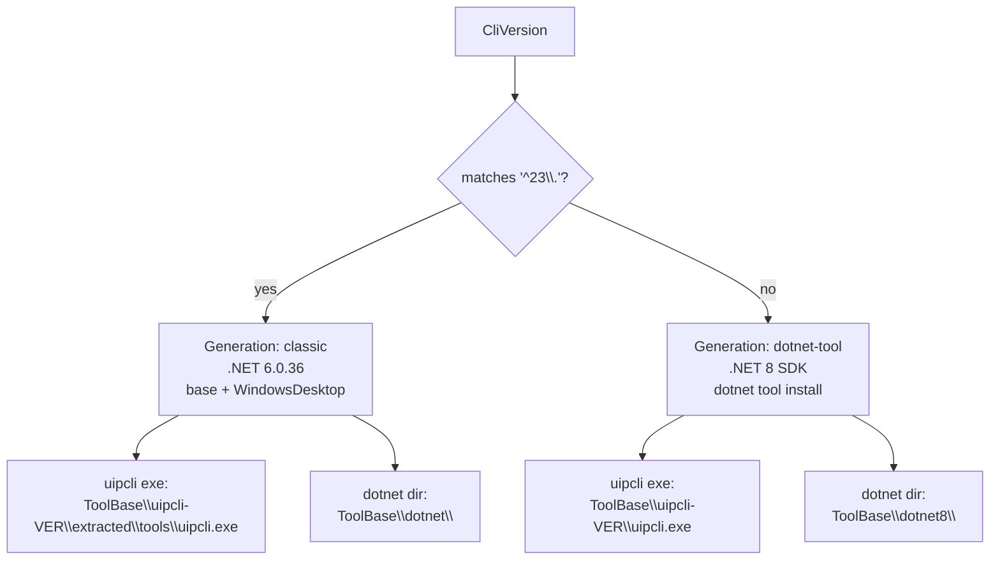

---

## 5. `Install-CpmfUipsPackCommandLineTool` — user-profile install flow

Downloads uipcli and its .NET runtime into `%LOCALAPPDATA%\cpmf\tools\` (user profile, no admin rights).
Each step checks whether the artifact already exists before downloading — safe to call repeatedly.

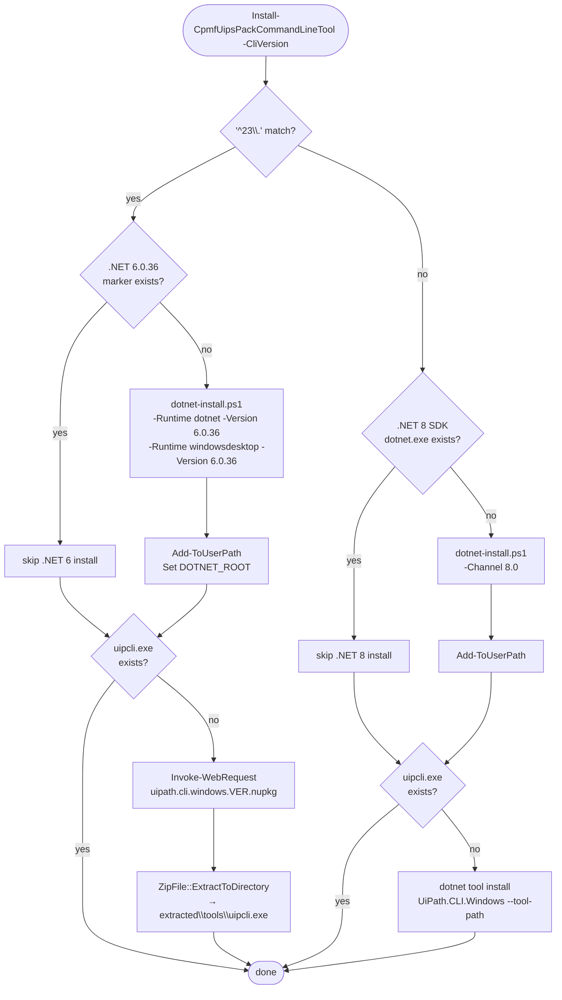

---

## 6. Version bump logic

Three version formats, three bump rules.

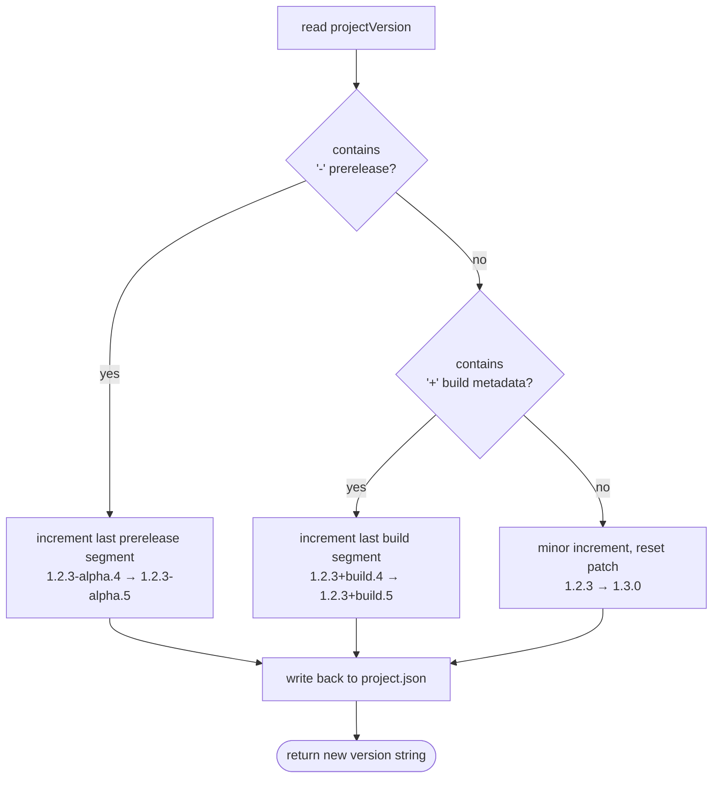

---

## 7. Multi-target build — version bump coordination

The version is bumped exactly once regardless of how many targets are built.

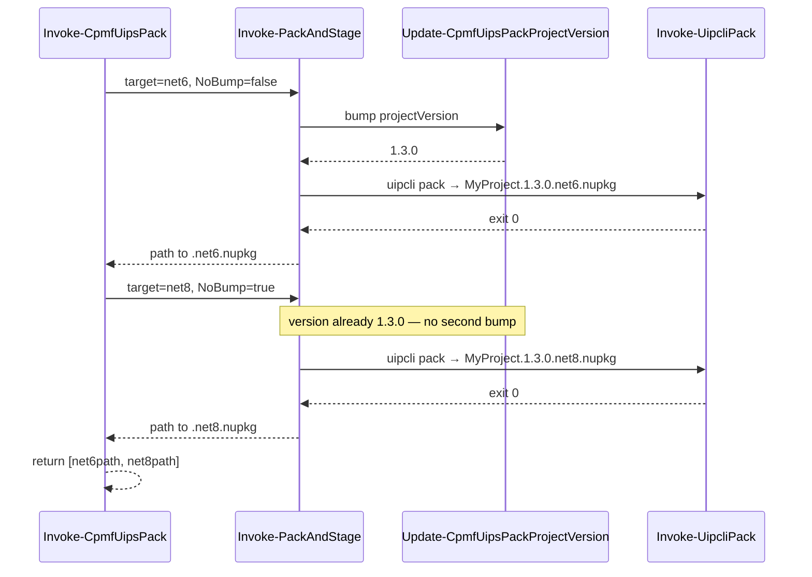

---

## 8. Git worktree mode — working directory isolation

When `-UseWorktree` is set, packing happens in a throw-away git worktree. The
working directory and any open Studio instances are never touched.

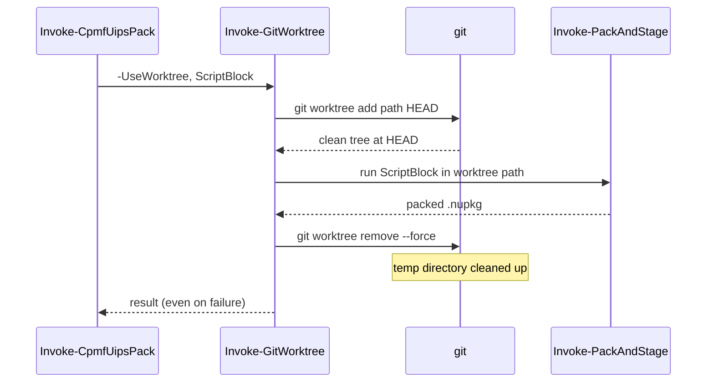

---

## 9. File lock — concurrency guard

Prevents two simultaneous pack operations on the same project from corrupting
`project.json` or the feed directory.

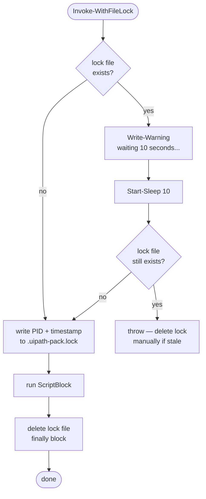

---

## 10. MultiTfm merge — single nupkg from two builds

For Library projects: takes the net8 nupkg as the base, injects the net6 TFM
from the net6 build, patches the nuspec, and re-packs.

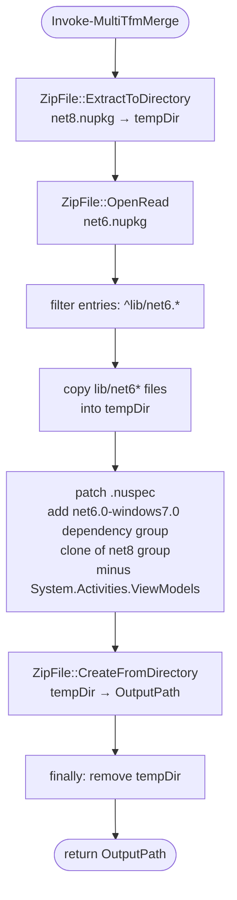

---

## 11. Public API surface — grouped by role

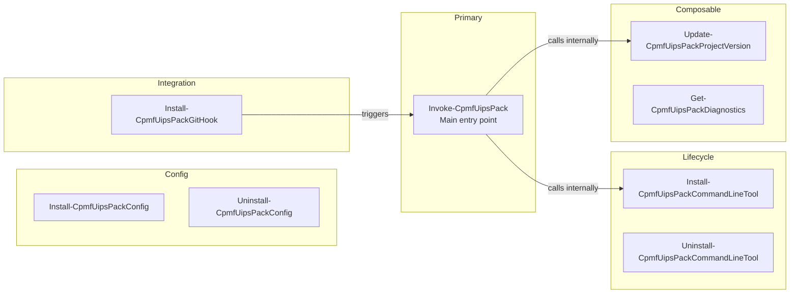

---

## 12. Tool path filesystem layout

What `Get-CpmfUipsToolPaths` computes and where each artifact lives on disk.

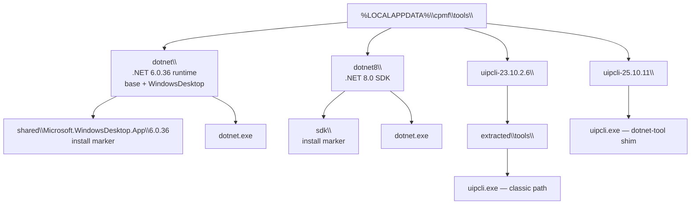
